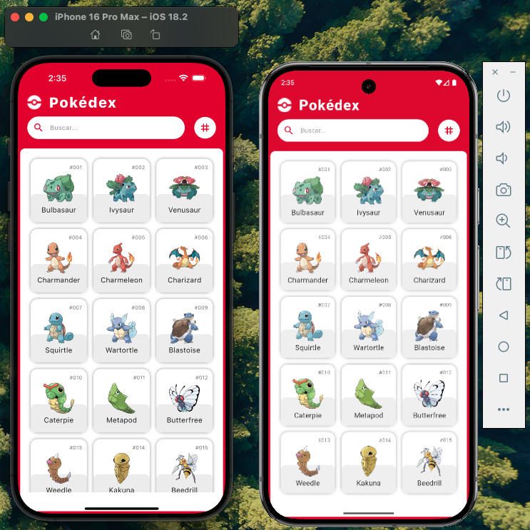
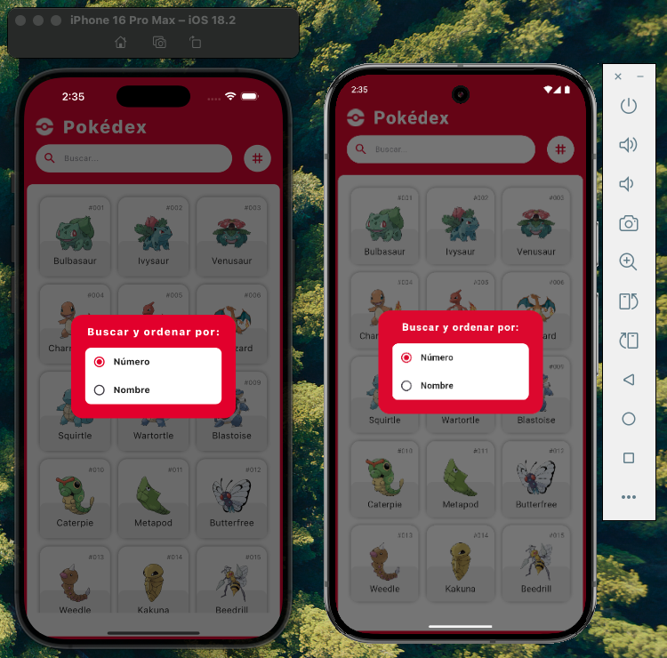
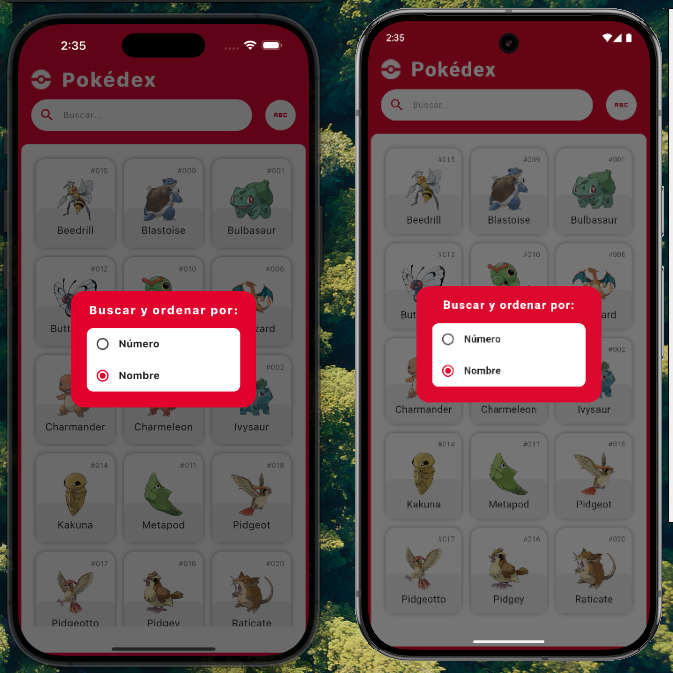
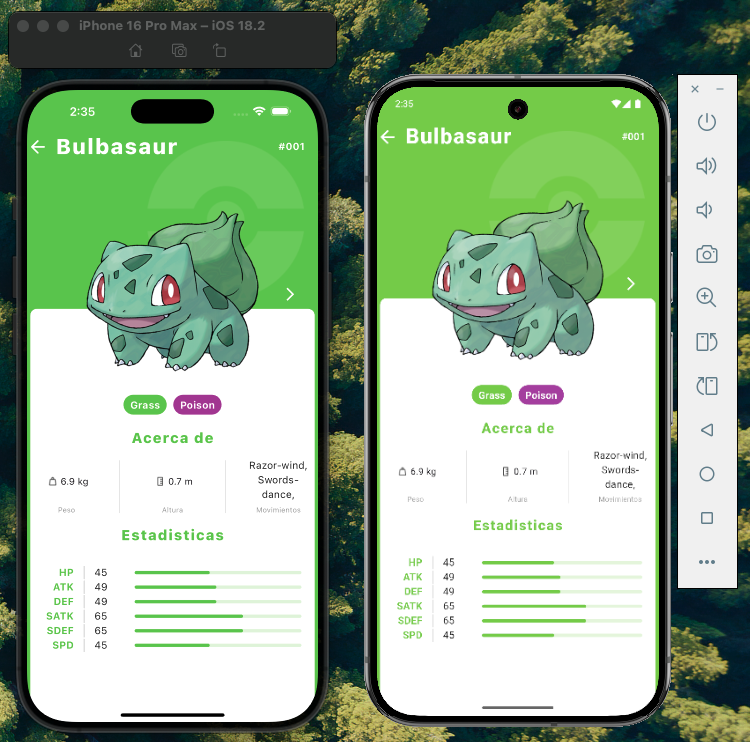
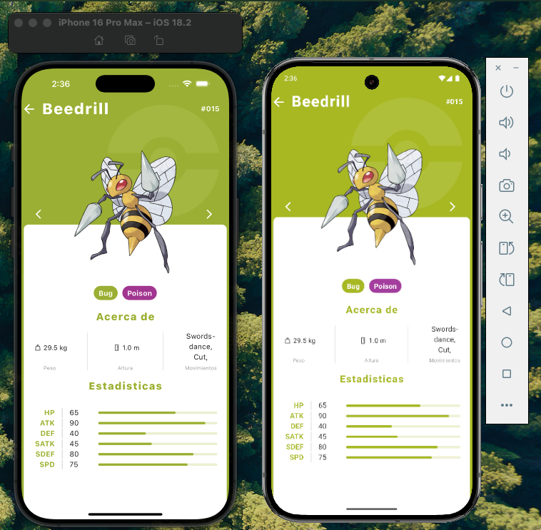

# Pokédex

## Descripción

Esta es una aplicación desarrollada en Flutter. El proyecto consume la [Pokémon API](https://pokeapi.co/) para obtener una lista de Pokémon y sus detalles.

## Características

1. **Pantalla Principal**: 
   - Muestra una lista de Pokémon con su nombre y una imagen en miniatura.
   - La lista es paginada y se carga más Pokémon a medida que el usuario se desplaza hacia abajo.
   - Funcionalidad de ordenamiento para la lista de Pokémon, por nombre o número.

2. **Búsqueda**: 
   - Se puede filtrar la lista de Pokémon por nombre y ID.

3. **Detalles del Pokémon**:
   - Al seleccionar un Pokémon, se muestra una pantalla de detalles con información adicional, como el nombre, imagen en tamaño completo, habilidades, tipo y más.

4. **Patrón de Diseño**:
   - Se implementa un patrón de diseño (por ejemplo, MVVM, Clean Architecture) para separar la lógica de negocio de la interfaz de usuario.

5. **Principios SOLID**:
   - Se sigue la estructura modular, extensible y fácil de mantener.

6. **Manejo de Errores**:
   - El código maneja adecuadamente los errores y las respuestas asincrónicas al consumir la API.

7. **Animaciones** (Opcional):
   - Se utilizan animaciones para mejorar la experiencia de usuario, como transiciones entre pantallas y acciones específicas.

## Requisitos

- **Flutter**: `Flutter 3.27.2`
- **Plataformas**: Android y iOS
- **Paquetes utilizados**:
   - `dio`: ^5.8.0+1 para el consumo de la API.
   - `flutter_riverpod`: ^2.6.1 para el manejo de estado.
   - `go_router`: ^14.8.1 para la navegación entre pantallas.
   - `cached_network_image`: ^3.4.1 para la carga eficiente de imágenes.
   - `path_provider`: ^2.1.5 para acceder a la ubicación del sistema de archivos.
   - `animation_wrappers`: ^3.0.0 para animaciones.
   - `shimmer`: ^3.0.0 para efectos de carga.
   - `sizer_pro`: ^2.2.0 para el manejo de tamaños de pantalla.
   - `flutter_bounceable`: ^1.2.0 para efectos de rebote en botones.
   - `lottie`: ^3.3.1 para animaciones Lottie.

## Instrucciones para ejecutar el proyecto

1. Clonar este repositorio:

   ```bash
   git clone https://github.com/usuario/nombre-del-repositorio.git


## Instalación 📲

Asegurate de tener flutter en las versiones especificadas del proyecto.

Sigue los siguientes pasos para correr la aplicación:

1. Clona este repositorio, accede a la carpeta raiz
2. Correr `flutter pub get` luego `flutter run` y seleccione un dispositivo ios o android.
3. Ya tendrás la aplicación corriendo en tu dispositivo.

Más información para instalar Flutter
https://flutterxperts.com/run-flutter-app-on-android-device-ios-device/


## ScreenShots











